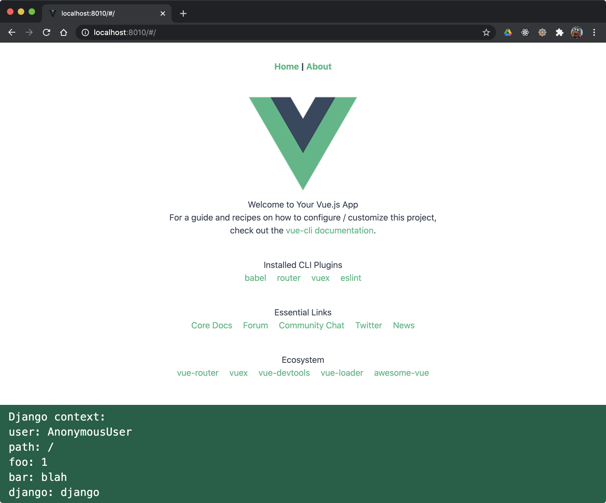

# Django Vue Hybrid (with vite)

This repo is intended as a proof-of-concept/base project for a hybrid Django/Vue app. This approach is [fairly opinionated](https://gist.github.com/Raisins/d3b437a76f84829f1582e7f806f044d5) and based on experimentation by [raisins](https://github.com/Raisins).

Aside from the Vue integration, this is a standard dockerized Django 3/PostgreSQL project.

The `common` app within `django_web` consists of one TemplateView with some extra context for demonstration purposes.

Vue is managed by vue-cli, which is installed globally within the container.

Node modules and commands are managed by Yarn.

Django and Vue are linked by `django-webpack-loader` and `webpack-bundle-tracker`. See the `common/index.html` template for use of the `` tag.

This project also uses [tailwindcss](https://tailwindcss.com/docs) as a [PostCSS](https://postcss.org/) plugin, along with plugins for css imports and nested rules. Tailwind is managed through the postcss-cli.

The `vue.config.js` file does several important things:
- configures devServer to use the port defined in `docker-compose.yml`
- handles publicPath/outputDir options for serve/build on dev/production
- alters the Webpack configuration to _not_ generate html files or handle preloading or prefetching output files, as these are handled by Django and webpack-loader
- defines how to chunk files

## Project Setup

- [Install Docker](https://docs.docker.com/get-docker/)
- Clone or fork the project
- `cp django_web/.env_example django_web/.env`
- `docker-compose up`
- Go into `djangovue_web` container `docker exec -it django_vue_web bash`
- In the docker container now run: `yarn install` and then `yarn serve`
- As configured via docker-compose.yml, the project will be running at `localhost:8000/`

## Development
Check out scripts defined in `package.json`

- `yarn serve` will compile tailwindcss and start both Django's dev server and vue-cli's dev server, configured for hot reloading
- Python packages are managed with [Poetry](https://python-poetry.org/). To use the Poetry cli within the container, you must first `source $HOME/.poetry/env`.

## Demo
Look at the following files to see a demo of Django and Vue playing together.
- `django_web/apps/core/views.py` defining a simple template view with some extra context
- `django_web/apps/core/templates/demo.html` passing the Django context to the Vue component as a prop
- `django_web/vue/components/DemoComponent.vue` a simple Vue component using Tailwindcss
- `django_web/vue/main.js` lazy loading the Vue component so it can be used in the Django template
